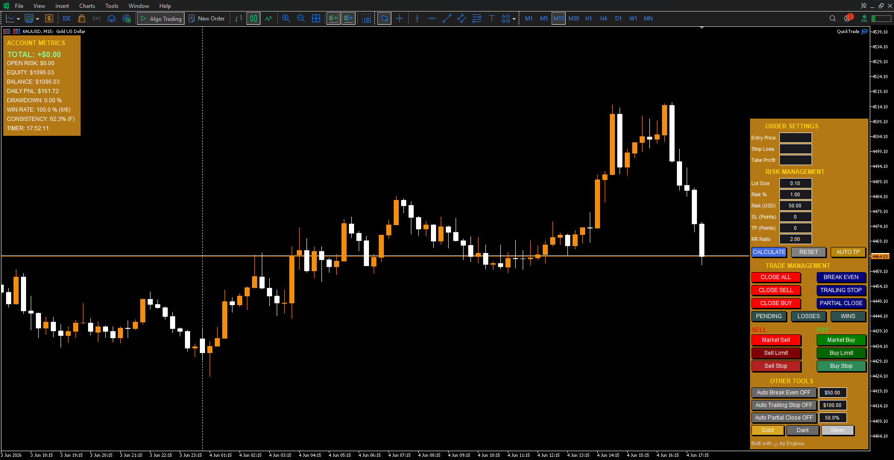

# 📘 QuickTrade – A Professional MT5 Trading Dashboard for Windows

**Version 1.1** – *Discipline, precision, and real‑time performance at your fingertips.*

QuickTrade is an all‑in‑one MetaTrader 5 tooling that merges **trade execution**, **automated risk management**, and **performance tracking** into a single, visual panel. It enforces a strict pre‑trade workflow and gives you live feedback on your trading behavior – so you trade your plan, not your emotions.

------------------------------------------------------------------------

## 🚀 What’s New in 1.1

- **Auto Partial Close** – automatically scales out a percentage of your position when profit reaches a chosen dollar amount.
- **Break Even with offset** – move your stop loss to entry *plus* a configurable number of points, locking in profit.
- **Improved trailing stop** – separate activation‑USD field; trailing distance adjustable on the fly.
- **Draggable entry / SL / TP lines** – now fully interactive with the edit fields.
- **Three‑click price entry** – click the edit field, then click anywhere on the chart to set Entry, Stop Loss, or Take Profit.
- **Theme refresh** – Gold, Dark, and Silver themes with button hover effects.
- **Enhanced consistency score** – includes count of winning trades and a (P)ass / (F)ail flag.
- **Multi‑account safe** – metrics are stored per account + symbol, surviving restarts and account switches.

------------------------------------------------------------------------

## 📦 Installation

1.  **Locate your MT5 data folder**\
    In MetaTrader 5, go to `File` → `Open Data Folder`.

2.  **Copy the EA file**\
    Place `QuickTrade.ex5` into the folder `MQL5\Services\`.\
    *If the `Services` folder does not exist, create it.*

3.  **Restart MT5** or right‑click in the **Navigator** panel and select **Refresh**.\
    QuickTrade will appear under **Services**.

4.  **Attach to a chart**\
    Drag `QuickTrade` onto the chart of the instrument you want to trade.\
    *Tip: Use a clean, separate chart window for the panel.*

5.  **Enable automated trading**\
    Go to `Tools` → `Options` → `Expert Advisors` and check **Allow automated trading** \> **Disable algorithmic trading when the account and profile has been changed**.\
    Also ensure “Allow DLL imports” is not required (the EA uses only standard MT5 functions).

6.  **Authorization**\
    QuickTrade is locked to specific account numbers. To run it on your own account, request access via:\
    📧 [**fundabrew\@gmail.com**](mailto:fundabrew@gmail.com){.email}\
    or Facebook: [**fb.me/iTrade.tools**](https://web.facebook.com/iTrade.tools)\
    *Please include your MT5 login/account numbers:*

    - account 1 (demo)
    - account 2 (personal broker)
    - account 3 (propfirm)

------------------------------------------------------------------------

## ⚙️ Input Parameters (Properties)

When you attach QuickTrade to a chart, you can adjust these inputs:

| Input | Description |
|--------------------------|----------------------------------------------|
| `EA Magic Number` | Magic number to identify all trades opened by this panel (default `14091991`). Keep unique if you run multiple instances on different symbols. |
| `Default Lots` | Fallback lot size when risk calculation is reset. |
| `Risk Percent` | Risk per trade as a percentage of current account balance (e.g., `1.0` = 1%). Used when `Risk USD` is 0. |
| `Risk USD` | Fixed dollar risk per trade. Overrides `InpRiskPercent` if \> 0. |
| `Default Risk:Reward Ratio` | Default risk‑to‑reward ratio used by the **AUTO TP** button. |
| `Slippage (points)` | Maximum allowed slippage in **points** (10 points = 1 pip for 5‑digit brokers). |
| `Trend line width` | Thickness of the draggable Entry, SL, and TP lines. |
| `Entry line color`, `Stop Loss line color`, `Take Profit line color` | Colors for the corresponding trend lines. |
| `Consistency Target` | Maximum percentage of daily P&L that can come from a single winning trade. Exceeding this flags a **(F)** in the metrics. |
| `Minimum USD profit to allow break‑even` | Minimum profit in USD before break even is allowed to move the stop to entry. |
| `Points locked in profit when BE is triggered` | Number of points to lock in profit above entry when break even is triggered. |
| `Distance (points) for trailing stop` | Distance (points) the stop loss trails behind price once trailing is active. |
| `Profit (USD) to trigger auto partial close` | Profit in USD that triggers an automatic partial close. |
| `Enable/disable sound alerts` | Enable / disable sound alerts for order execution and failures. |

------------------------------------------------------------------------

## 🧭 How to Use – A Beginner’s Walkthrough

The QuickTrade panel is divided into several logical sections. Let’s explore them from top to bottom.

### 1. 📊 Account Metrics Dashboard (left side)

This always‑visible strip shows your current performance at a glance:

- **TOTAL** – unrealized profit/loss of all positions opened by QuickTrade on this symbol.
- **OPEN RISK** – sum of the dollar amount you would lose if every open position hit its stop loss.
- **EQUITY / BALANCE** – live account numbers.
- **DAILY PNL** – realized profit from today’s closed trades (resets at midnight).
- **DRAWDOWN** – percentage drop from today’s highest equity peak.
- **WIN RATE** – today’s winning trades vs total closed, shown as a percentage and count.
- **CONSISTENCY** – what percentage of today’s profit comes from your single largest winning trade. If it exceeds your target (default 20%), you see **(F)** – a warning. Otherwise **(P)** for “pass”. A low number means you are winning consistently, not relying on one lucky trade.
- **TIMER** – current server time.

> 🧠 *Tip:* Make it a habit to check your daily drawdown and consistency before entering a new trade.

### 2. ⚙️ Order Settings

This is where you plan every trade **before** execution.

| Field | What it does |
|-------------------------|----------------------------------------------|
| **Entry Price** | Price at which your pending order will be placed. For market orders, this field is ignored. |
| **Stop Loss** | Price where you will exit to limit losses. |
| **Take Profit** | Price where you will exit to take profit. |
| **Lot Size** | Volume of the trade. Best set automatically using the **CALCULATE** button (see Risk Management). |
| **Risk %** | Percentage of your account balance you risk on this trade. |
| **Risk (USD)** | Fixed dollar amount you risk. If \> 0, it overrides Risk %. |
| **SL Points** | Distance from entry to stop loss in **points** (1 point = 0.1 pip on 5‑digit brokers). Fill this *or* the SL price. |
| **TP Points** | Same for take profit. |
| **RR Ratio** | Desired reward‑to‑risk (e.g., 2.0 means TP is twice the SL distance). Used by the **AUTO TP** button. |

**Three ways to set prices:**\
1. **Type numbers** directly into the edit fields.\
2. **Points + Auto calculation** – enter SL/TP points and the price will be computed automatically.\
3. **Chart‑click mode** – click any edit field (Entry, SL, or TP) to activate “waiting” mode, then click anywhere on the chart to set that price.

### 3. 🧮 Risk Management Buttons

- **CALCULATE** – reads your Entry, Stop Loss, and risk settings, then computes the exact lot size that keeps your risk constant.\
  ***This is the most important button. Always use it!***
- **RESET** – clears all trade settings back to default values.
- **AUTO TP** – uses your current SL distance and the RR ratio to automatically set a Take Profit level.

> 🧠 *Why constant risk matters:* If your stop distance is 20 pips today and 50 pips tomorrow, a fixed lot size would risk vastly different amounts. The CALCULATE function ensures you always risk the same percentage or dollar amount – the professional’s edge.

### 4. 🚀 Execution – Market & Pending Orders

- **Market Buy / Market Sell** – executes immediately at the current market price.\
  *SL and TP must be on the correct side of the price.*
- **Buy Limit / Sell Limit** – places a pending order at a price **better** than current market.
- **Buy Stop / Sell Stop** – places a pending order at a price **worse** than current market (breakout strategy).

The panel will validate distances, respect broker minimum stop levels, and normalize the lot size to your broker’s volume step.

### 5. 🔧 Trade Management (Manual Controls)

- **CLOSE ALL / CLOSE SELL / CLOSE BUY** – closes all positions, only sells, or only buys belonging to this symbol and magic number.
- **CLOSE LOSSES / CLOSE WINS** – selectively close losing or winning trades.
- **BREAK EVEN** (manual) – moves the stop loss to the entry price (plus any offset from the input) **only if** the trade is in profit by at least the “Min Profit USD” input. This turns a trade into a “free trade”.
- **TRAILING STOP** (manual) – adjusts the stop loss to the current price minus (or plus) the trailing distance. Use this to lock in profits.
- **PARTIAL CLOSE** – closes exactly 50% of each position. Useful for scaling out manually.
- **PENDING** – deletes all pending orders that were created by this panel.

### 6. 🎛️ Other Tools – Automated Risk Functions

These toggles run continuously on every tick:

| Toggle | What it does | Accompanying Field |
|------------------|----------------------|--------------------------------|
| **Auto Break Even** | Monitors all positions; when profit exceeds the value in the USD edit field, it moves the stop loss to entry + `Points locked in profit when BE is triggered`. | `$50.00` (adjustable) |
| **Auto Trailing Stop** | Activates once profit reaches the USD value in the edit field. Then the stop loss trails price by `Distance (points) for trailing stop`. | `$100.00` (activation threshold) |
| **Auto Partial Close** | Closes a configurable percentage of each position the first time its profit exceeds the activation USD. The same position is never partially closed twice. | `50%` (adjustable) |

- The **Auto Break Even** and **Auto Trailing Stop** edit fields accept a dollar sign (e.g., `$50.00 or 50`). The panel will parse it.
- The **Auto Partial Close** field expects a percentage (e.g., `50` means 50%). You can type `50%` or just `50`.

Click the toggle buttons to turn each automation ON or OFF. They turn **dark gold** when active.

### 7. 🎨 Themes & Sound

At the bottom of the panel, three buttons switch the color theme:

- **Gold** – warm golden background (default)
- **Dark** – dark gray background
- **Silver** – light silver background

Sound alerts are enabled/disabled via the `Enable/disable sound alerts` input parameter. You’ll hear a confirmation sound on successful orders and an error sound on failures.

------------------------------------------------------------------------

## 🔧 Advanced Features (How They Work)

### Draggable Trade Levels

Three horizontal trend lines appear for Entry, Stop Loss, and Take Profit when you click each corresponding input field. You can **drag them directly on the chart** – the corresponding edit fields update instantly. This is perfect for visual traders who prefer adjusting levels with the mouse.

### Account Switching Made Easy

QuickTrade now **automatically detects** when you switch accounts (e.g., demo ↔ live) or change the chart’s symbol. It saves the current account’s metrics, then loads or rebuilds the metrics for the new account + symbol combination. Just switch accounts via `File` → `Login` and wait a few seconds – the metrics will refresh. Enable **Algo Trading** at the top tab of your mt5 when switching account.

### Consistency Score as a Discipline Tool

The **CONSISTENCY** metric shows what percentage of your daily P&L is made up by your single largest winning trade. If that number exceeds your target (default 20%), you see **(F) – Fail**. This warns you that your results are “lumpy” – one lucky trade is dominating. Aim for **(P) – Pass**.\
*Note: It’s normal to see (F) early in the day when you have only a few closed trades. The system becomes more meaningful as your trading day progresses.*

### Risk‑First Position Sizing

When you use the **CALCULATE** button, the lot size is computed as:\
*lot = riskAmount / (stopLossPoints \* tickValue)*

- `riskAmount` is either your fixed USD risk or your chosen percentage of the account balance.
- `tickValue` is the monetary value of one point for one standard lot (provided by your broker).

This ensures your risk per trade is **constant regardless of volatility or stop distance** – the hallmark of professional risk management.

### Break Even with Offset

The new input `Points locked in profit when BE is triggered` allows you to lock in a small profit instead of just break even. For example, if you set offset = 100 points (10 pips), the stop loss will be moved to `entry + 100 points` when the conditions are met.

------------------------------------------------------------------------

## 📈 Practical Tips for Daily Use

1.  **Start each day** by glancing at the Metrics Dashboard. If you’re already down more than 2% (drawdown), consider trading smaller or stopping.
2.  **Pre‑trade routine**:
    - Set your Entry, SL, and TP (using points or chart‑click).
    - Make sure your RR ratio is ≥ 1.5 (or your personal minimum).
    - Click **CALCULATE** – the lot size will adjust to your fixed risk.
3.  **Use Auto Break Even** after price moves 10‑15 pips in your favor. This eliminates risk on the trade.
4.  **Use Auto Trailing Stop** to let profits run. Set activation at, say, +20 USD and trailing distance at 100 points. It will only start trailing after that profit is reached.
5.  **Scale out with Auto Partial Close** – lock in gains by closing 50% of the position when profit hits your activation level. Let the remainder run with a trailing stop.
6.  **Monitor consistency**. If you hit an (F) rating, it’s a signal to ensure your next trades are not oversized. Consistent small winners beat one grand slam.

------------------------------------------------------------------------

## ⚠️ Troubleshooting & Maintenance

| Problem | Possible Solution |
|-------------------------|-----------------------------------------------|
| Panel doesn’t appear on chart | Make sure the account is **authorized**. If not, contact the developer. Also verify that automated trading is enabled in Tools → Options → Expert Advisors. |
| “Order failed – Invalid stops” | Your broker requires a minimum distance between price and stop loss. Increase your SL distance in points. |
| Metrics show zero after restart | QuickTrade saves metrics in **Global Variables**. If you reset the terminal’s global variables, data is lost. They will rebuild automatically after the next closed trade. |
| Auto Partial Close doesn’t fire | Check that the position’s profit exceeds the activation USD, and that the partial close percentage results in a volume ≥ the broker’s minimum lot size. Each position is partially closed only **once**. |
| Account switch causes a brief metrics freeze | That’s normal – the panel saves old metrics, loads new ones, and rebuilds if necessary. Wait a few seconds and the display will update. |
| Buttons overlap after chart resize | The panel repositions automatically on chart resize. If it doesn’t, detach and reattach the QuickTrade. |

------------------------------------------------------------------------

## 📄 License & Disclaimer

This software is provided for **educational and professional trading purposes**. The author assumes no responsibility for financial losses incurred while using this tool. Past performance does not guarantee future results. Always trade with risk capital only.

**Author:** Enginux\
**Version:** 1.1\
**Built for:** MetaTrader 5 (build 5836), 28 April 2026, Windows\
**Contact:** [fundabrew\@gmail.com](mailto:fundabrew@gmail.com) \| [fb.me/iTrade.tools](https://web.facebook.com/iTrade.tools)

------------------------------------------------------------------------

***Trade disciplined. Trade consistently. Trade with QuickTrade.***
